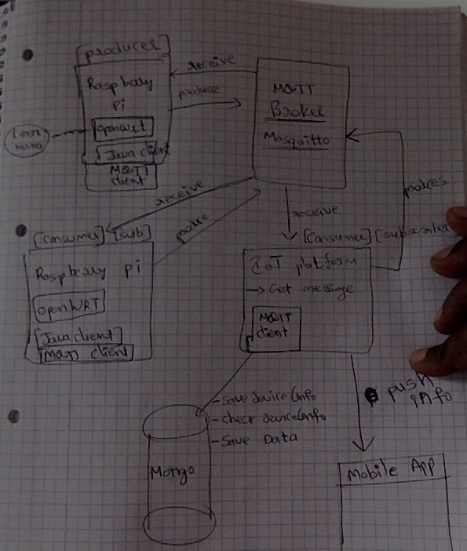

####### MQTT/MQTT-SN (MQ Telemetry Transport for sensors)
* __MQTT__ 
** Is an machine-to-machine TCP/IP connectivity protocol
** MQTT stands for MQ Telemetry Transport. It is a publish/subscribe, extremely simple and lightweight messaging protocol, designed for constrained devices and low-bandwidth, high-latency or unreliable networks.
* __MQTT-SN__ 
** For non-TCP/IP protocol 
* __MQTT broker__
** The central communication point in charge of dispaching all the messages b/w senders and the rightful receivers.
** The topic is the routing information for the broker
* Spring has only support for MQTT 
* http://dev.lelylan.com/api#api-physical-mqtt
* Eclipse Paho client has only C based library for MQTT-SN. Need to write our own Java code using JNI to support MQTT-SN 

###### The Raspberry Pi
* Raspberry Pi is a low cost, credit-card sized computer that plugs into the monitor or TV, and uses standard keyboard and mouse.
* Example: End to End MQTT communication example: http://lelylan.github.io/lab-projects/raspberry-pi-light/
* __Installation__
** Can use SD Formatter 4.0 to format the SD and copy the NOOBS Raspberry pi bootable content
** 
* __Useful Commands__
** file raspbian-jessie.img : Displays the file information in MacOS
** hostname -I -> to display the pi ipAddress
** startx to start the GUI 
** ping raspberrypi.local
** ssh pi@raspberrypi.local
** pi-finder: Is an utility used to find the Raspberry Pi IP address
** pi-filler: Is an utility to mount the img to SD Card
** hdmi_force_hotplug=1 add it in config file, SD card to force HDMI display
** Find the Pi ip : https://github.com/thoqbk/pi-oi
** arp -a
* __Troubleshoot__
** Make sure SD card is not locked 
** After power plug is connected, Green light should blink
** 

###### OpenWRT
* Open source Linux distribution for embedded devices(typically wireless routers)

###### QEMU (Quick EMUlator)
* QEMU is a generic and open source machine emulator and virtualizer.
* Raspberry Pi Emulator
** XCode
** HomeBrew
** Install QEMU
*** brew install qemu --env=std
** RPi disk image
** Linux kernel image compiled for ARM
** command : 
qemu-system-arm -cpu arm1176 -m 256 -M versatilepb -no-reboot -serial stdio -append "root=/dev/sda2 rootfstype=ext4 rw init=/bin/bash console=ttyAMA0,115200" -kernel kernel-qemu -hda 2013-07-26-wheezy-raspbian.img
qemu-system-arm -cpu arm1176 -m 256 -M versatilepb -no-reboot -serial stdio -append "root=/dev/sda2 rootfstype=ext4 rw init=/bin/bash console=ttyAMA0,115200" -kernel kernel-qemu-4.1.13-jessie -hda raspbian-jessie.img
* To emulate the Raspberry Pi on OS X
* Link: https://sourceforge.net/projects/raspberrypiemulator/?source=directory
* __How to Use__
** Get the Raspberrypi from https://sourceforge.net/projects/raspberrypiemulator/ 
** Run /raspberry-pi-emulator-1.6.1/Mac OS X/Raspberry Pi Emulator.app/Contents/MacOS/Raspberry Pi.sh (run ./Raspberry\ Pi.sh)
** Might take time as it needs to download the Raspbain OS image and kernal 
* __Useful commands/tools__
** hostname -I -> to display the pi ipAddress
** ping raspberrypi.local
** ssh pi@raspberrypi.local
** pi-finder: Is an utility used to find the Raspberry Pi IP address
** pi-filler: Is an utility to mount the img to SD Card
** hdmi_force_hotplug=1 add it in config file, SD card to force HDMI display
** Find the Pi ip : https://github.com/thoqbk/pi-oi
** arp -a
** 

###### AllJoyn (AllseenAlliance.org)
* AllJoyn is a collaborative open-source software framework that makes it easy for developers to write applications that can discover nearby devices, and communicate with each other directly regardless of brands, categories, transports, and OSes without the need of the cloud.
* AllJoyn framework: it serves as the glue to allow devices from different companies, running on different operating systems, written with different language bindings to all speak together, and just work
* common services and interfaces that solves a specific use case, such as onboarding a new device for the first time, sending notifications, and controlling a device
* AllJoyn App: An application that uses the AllJoyn framework. Apps use either the AllJoyn Core APIs or the AllJoyn Service Frameworks API. Apps can either use the Standard Core or Thin Core implementations.
* AllJoyn-enabled device: An entity which has an AllJoyn application installed to send or receive notifications using the Notification service framework interface
* 

###### IoT Gateways

###### PoC
* __Client (Producer)__
** Install the Raspberry Pi Image
** Install the OpenWRT on Raspberry Pi image
** Emulate the Raspberry Pi in Mac OS
** Install the Client specific capabilities on Raspberry Pi (May be like Java client to run)
* __Broker__
** Install the MQTT Broker on Mac OS
** 
* __Client (Consumer) (Subcribers)__
** Could be any device like Raspberry Pi or Mobile or desktop

###### User Stories
* DONE -- As a Dev I want to see a simple Spring application to simulate the Publisher and Subscriber communication 
* DONE -- As a Dev I want to see running client in the Raspberry Pi emulator, which publishes the info on a topic
* DONE -- As a Dev I want to see running client in the Raspberry Pi emulator which subscribe and consumes the info on a topic
* DONE -- As a Dev I want to see running client on Mac OS as a Subscriber to get the info published by the Raspberry Pi client 
* DONE -- As a Dev I want to see the communication b/w the Bridge and the IoT platform.
* As a Dev, I want to understand the code written for Rules
    -- Rule, Trigger Channel, Choose Trigger, Action Channel, Choose Action
    -- Need an example with explanation ?
    -- Where Do I see list of defined Rules
    
* As a Dev, I want to all the possible Configurations for MQTT clients
* As a Dev, I want to PoC Android app with MQTT Client (Produce and Consume)
* As a Dev, I want to implement few "Spring Integration Flows" so we can use them properly
* As a Dev I want to have JSON Message Converter mechanism to handle after received in the MQTT client
* As a Dev, I want to see required config / logic to message handled guarantee
* As a Dev, I want to basic classes, interfaces in place to produce and consume the Services
* As a Dev, I want to see Generic Consumer for all Topics ? is this make sense (PoC)
* As a Dev, understand the Parallel message processing , Best solution to implement it
* As a Dev, I want to see Best Messaging format for MQTT Protocol
* As a Dev, I want to Know the Max Size of Message can send across
* As a Dev, I want to understand the QoS , so I can implement the message processed guarantee.
* As a Dev, I want to understand best practices to implement the MQTT clients, generic, multiple oe combination ?
* As a Dev, Understand Can we define multiple clients per Topic
* As a Dev, I want to see Architecture diagram for CToT-MQTT , message flow and message processing
* As a Dev, I want to Understand on Replication, Fault tolerance, HA and Scalability from Broker point of view

###### Spring Integration
* Channel: A medium through which a message is transmitted to its intended audience.
* pipes-and-filters: The "filters" represent any component that is capable of producing and/or consuming messages, and the "pipes" transport the messages between filters
* 
* Why type of Channel adapters are available
** LoggersChannelAdapter
** InboundChannelAdapter
** 
* Important Classes and Interfaces
** Message(header, Payload)
** MessageChannel(PollableChannel, SubscribableChannel)
*** A Message Channel represents the "pipe" of a pipes-and-filters architecture.
*** Producers send Messages to a channel
*** Point-to-Point
**** at most one consumer can receive each Message sent to the channel
*** Publish/Subscribe
**** will attempt to broadcast each Message to all of its subscribers
*** Both give flexibility to configure how many consumers will ultimately receive each Message
*** should the channel buffer messages ?
*** Pollable Channels are capable of buffering Messages within a queue
** MessageHandler
** Message Channel Implementations
*** 
* Message Converters/Transformations
** Convert from one message format to other, example: XML to String
** Also responsible for add, remove the header values
* Message Endpoints
** A Message Endpoint represents the "filter" of a pipes-and-filters architecture
** A Message Endpoint handles the Messages
** A Message Endpoint mapped to the Message Channel
* Message Router
** A Message Router is responsible for deciding what channel or channels should receive the Message next (if any).
** A Message Router is often used as a __dynamic alternative__ to a statically configured output channel on a Service Activator or other endpoint capable of sending reply Messages
** 
* Splitter
** responsibility is to accept a Message from its input channel, split that Message into multiple Messages, and then send each of those to its output channel.
* Aggregator
** opposite of Splitter
* Service Activator
** A Service Activator is a __generic endpoint__ for connecting a service instance to the messaging system
* Channel Adapter
** is an endpoint that __connects__ a __Message Channel__ to __some other system or transport__
** 

###### Spring MQTT Integration 
* http://docs.spring.io/spring-integration/docs/4.3.0.RELEASE/reference/html/mqtt.html
* https://github.com/spring-projects/spring-integration-samples/tree/master/basic/mqtt
* https://github.com/andypiper/spring-int-mqtt

###### Mosquitto 
* Open source MQTT Broker 
* https://github.com/mqtt/mqtt.github.io/wiki/Server%20support

###### Architecture
* __Decisions to take__
** One or more clients per Topic
** Async physical flow
** Message contract 
*** Format/Structure ?? Example: Device info ?
*** Eg: {deviceId:, Properties: {[id: , value: expected: , pending: ],[]}}
** Generic MQTT client to handle all the message and distribute to the threads to process them 
** Separate MQTT client per Topic 
** Understand on Replication, Fault tolerance, HA and Scalability from Broker point of view
* References
** https://github.com/lelylan/lelylan/
** http://dev.lelylan.com/#overview-tutorials
** http://lelylan.github.io/devices-dashboard-ng/index.html#/login
** https://medium.com/@lelylan/how-to-build-an-high-availability-mqtt-cluster-for-the-internet-of-things-8011a06bd000#.g2w5mtnaj
** 

###### Solution Design general considerations
* Device Topic : device/deviceId
* CIoT Topic : device/deviceId
* Device Properties : 
** Value, expected and pending helps in Async communication
** Event helps in performing the action 
*** Example: Topic: device/DeviceId, payload property 'Event: update'
* Async Communication: Based on Device Properties, Device or App send the Appropriate status to update the system ?
** Example: 
*** Mobile -> turn on light -> Publish -> (Msg Payload with Event as 'update' and Properties {value:off,Expected:on, pending:true })
* MQTT Channel Adapter with Configuration like Topic(device/activation) and MessageConverter(JSON?) => Pub/Sub Message Channel => Message Handler => Consume CIoT Platform
###### Setup MQTT cluster
* 

###### Parameters comes into play for MQTT Client and CIoT communication 
* Topic Name
* Channel Type (Point-to-Point/Pub-Sub)
* Client need Acknowledgement back success/failure?
* Service call to CIoT platform
* Async physical flow

###### Incoming Message Handle Mechanism
* Broker delivers the message to one of the topic subscriber client 
* Parse the message (structure will be know based on Topic)
* Process the message
** Delegate to the CIoT service layer (internally it performs whatever needs to be)
** 
* Finally, depend on the topic and response from service layer, produce the message by certain Topic

###### Outgoing Message Handle Mechanism
* Prepare the message
* Execute the Producer MQTT client to send the message to the topic
* Broker will deliver to right subscriber

###### Questions
* Add/Kill the MQTT publisher or consumer on the fly at runtime
* What will be the message exchange format (JSON, YAML, XML)
* How can we effectively make use of Spring integration flows ?
* How many MQTT clients required at any given point of time to handle the message 
* How to make sure we don't loose the messages and handled guranteed ? (Quality of Service) for every message
* Make sure parallel message streaming or handle async without compromising on the performance and message lost ?
* Deployment Model for MQTT Client in CIoT Platform ?
** Should be just a seperate threads(multiple clients) to process messages
** Could be a seperate module deployed in platform so that modular and independent?
* 
<ul><li></li></ul>

###### Functional Stories and Estimation in days

| Epic/Feature | No | Story | Estimation | Questions/Comments |
|---|
| Setup Cluster | | Setp MQTT Server/Broker |  | Setup the Load balancer, Availability, etc. DevOps/Infra team will take care |
| Security | | SSL Communication Setup | | |
| Security | | Authentication | | |
| Security | | Authorization |  | | 
| On-Board | 1.1 | Activate the Home Bridge | | <ul><li>*IoT App Work(REST call to Activate HB). Show HB info in App.</li> <li> Don't we need to notify the HB successfully setup done ? If yes, Need to consider work for App to HB communication</li></ul> |
| On-Board | 1.2 | Add/Connect device to Home Bridge so that it can be activated | | <ul><li>Assumption, User should activate from IoT App?</li></ul> |
| On-Board | 1.3 | Activate a device(home Sensor product) |  | <ul><li>*IoT App Work(REST call to Activate device)</li><li>Remove and Deactivate device ?</li><li>What if same devices trying to activate again ?</li></ul>  |
| On-Board | 1.4 | List services available| | <ul><li>*IoT App Work(REST call to get all service for a device)</li></ul> |
| On-Board | 1.5 | Add service| | <ul><li>*IoT App Work</li><li> Remove/Update Service ?</li></ul> |
| On-Board | 1.6 | Grant read access | | <ul><li>*IoT App Work</li></ul> |

| Story| Topic name | Implementation | Configuration |
|---|
| 1.1 | homebridge/activation  | (Only if HB and App communication required) After the successfull Activation with CIoT platform => publish(mobile app) => Sub(HB) => Ack to HB | QoS: |
| 1.2 | device/connect | After successful discovered the device => Pub(HB) => Sub(IoT App) => Store the device info in Mobile App||
| 1.3 | device/activation(on-board) | pub(HB) => Sub(Platform) => Convert Message => successfully activated => pub(Platform) => sub(HB) => Convert Message | QoS: |
| 1.3(?) | device/activation(on-board) | pub(IoT App) => Sub(Platform) => Convert Message => successfully activated => pub(Platform) => sub(IoT App) => Convert Message | QoS: |

###### Functional Questions 
* Smart Watch, Fitness Band will they come into business ?
* Why do we have Web App though we target Mobile App?
*    

###### Eclipse IoT
* http://iot.eclipse.org/
* https://eclipse.org/kura/
* https://eclipse.org/smarthome/
* http://www.eclipse.org/paho/

###### Technical Terms

|---|
|Raspberry Pi|MQTT|MQTT-SN|MQTT Broker|AllJoyn|OpenWRT|QEMU|Mosquitto|XMPP|Spring Integration MQTT|
|MQTT Client|IoT|CIoT Platform|Mongo DB|Emulator|

